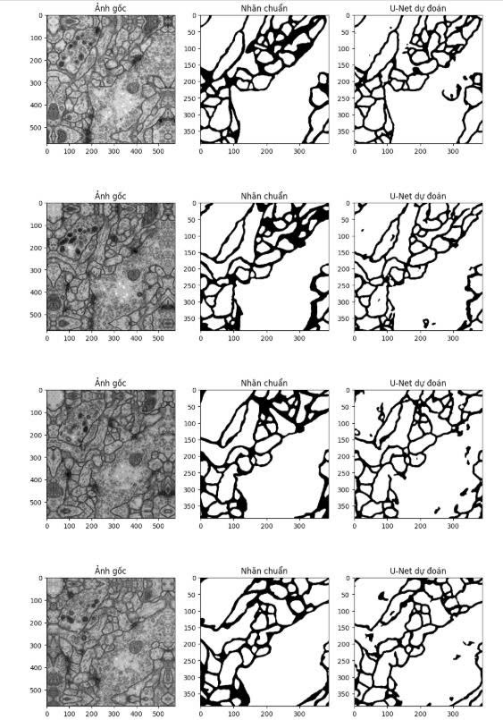

# UNet Image Segmentation - ISBI 2012

> Triển khai kiến trúc **U-Net** gốc (Ronneberger et al., 2015) cho bài toán phân đoạn ảnh y sinh trên tập dữ liệu **ISBI 2012 EM Segmentation Challenge**.
>
> Implementation of the original **U-Net** architecture (Ronneberger et al., 2015) for biomedical image segmentation on the **ISBI 2012 EM Segmentation Challenge** dataset.

---

## Tổng quan / Overview

| Mục / Item | Chi tiết / Detail |
|---|---|
| Tập dữ liệu / Dataset | ISBI 2012 (ảnh kính hiển vi điện tử / electron microscopy) |
| Bài toán / Task | Phân đoạn nhị phân (tế bào / nền) — Binary segmentation (cell / background) |
| Framework | PyTorch |
| Nền tảng / Platform | Kaggle (GPU T4) |

---

## Kiến trúc / Architecture

Tái hiện trung thực kiến trúc U-Net theo bài báo gốc / Faithful re-implementation of the original U-Net paper:

- **Encoder**: 4 khối giảm mẫu (double conv, không padding) + MaxPool
- **Bottleneck**: 512 → 1024 channels
- **Decoder**: 4 khối tăng mẫu (ConvTranspose2d + crop-and-concat skip connections)
- **Output**: Conv 1×1 → bản đồ phân đoạn 2 lớp

---

## Hàm Loss / Loss Function

**Weighted cross-entropy** tùy chỉnh để xử lý mất cân bằng lớp và phân tách tế bào dính nhau / Custom weighted cross-entropy to handle class imbalance and touching cell separation:

```
w(x) = wc + w0 * exp(-((d1 + d2)²) / (2σ²))
```

Trong đó / Where: `d1`, `d2` là khoảng cách tới hai biên tế bào gần nhất / distances to the two nearest cell borders (w0=10, σ=5).

---


## Visual Results


## Kết quả / Results

| Metric | Score |
|--------|-------|
| Mean IoU (tập test / test set) | **0.8657** |

---

## Cấu trúc file / File Structure

```
unet-segmentation/
├── model.py        # Kiến trúc U-Net / U-Net architecture
├── dataset.py      # ISBIDataset + weight map
├── train.py        # Vòng lặp huấn luyện / Training loop
├── evaluate.py     # Đánh giá IoU + visualize / IoU evaluation + visualization
└── README.md
```

---

## Tài liệu tham khảo / References

- Ronneberger, O., Fischer, P., & Brox, T. (2015). [U-Net: Convolutional Networks for Biomedical Image Segmentation](https://arxiv.org/abs/1505.04597). MICCAI.
- Dataset: [ISBI 2012 EM Segmentation Challenge](http://brainiac2.mit.edu/isbi_challenge/)
